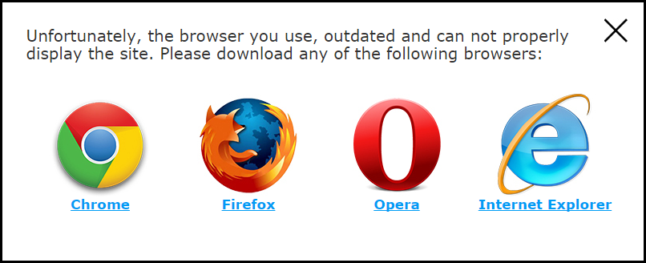

finalReject
===========

finalReject — plugin that displays the popup with a proposal to upgrade browser in older versions of Internet Explorer. The popup may be closed by user. After closing, it does not disappear forever, and is attached to the top of the browser window, and to be displayed in the minimized view.

Full view of popup: 


That simple to use, all you need its just add this code at the `<head>` tag:

```
<!--[if lt IE 9]>
	<link rel="stylesheet" href="/reject/reject.css" media="all" />
	<script type="text/javascript" src="/reject/reject.min.js" data-text="Unfortunately, the browser you use, outdated and can not properly display the site. Please download any of the following browsers:"></script>
<![endif]-->
```